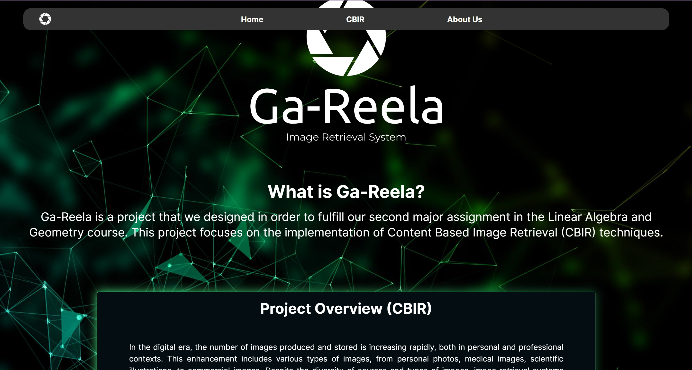
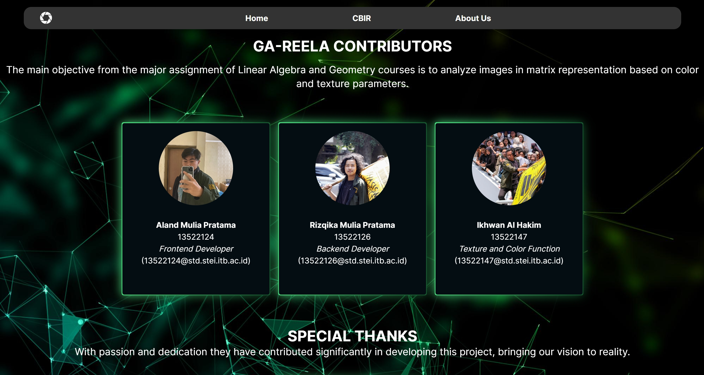

# Algeo02-22124
Image Retrieval System Program
# Tugas Besar 02 Aljabar Linier dan Geometri
> Image Retrieval menggunakan cosine similarity
## Daftar Isi
* [Anggota](#anggota)

## Anggota
Kelompok Ga-Reela
| Nama | NIM |
|---|---|
| Aland Mulia Pratama | 13522124 |
| Rizqika Mulia Pratama | 13522126 |
| Ikhwan Al Hakim | 13522147 |
## Deskripsi
Pencarian dan Pengambilan Gambar Berbasis Konten (CBIR) merupakan proses untuk mencari dan mengambil gambar berdasarkan isi visualnya. Proses ini dimulai dengan mengekstrak fitur-fitur penting dari gambar, seperti warna, tekstur, dan bentuk. Setelah fitur-fitur ini diekstrak, mereka diwakili dalam bentuk vektor atau deskripsi numerik yang dapat dibandingkan dengan gambar lain. Selanjutnya, CBIR menggunakan algoritma pencocokan untuk membandingkan vektor fitur dari gambar yang dicari dengan vektor fitur gambar dalam dataset.
## Screenshots
# Tampilan Home Page

# Tampilan CBIR

# Tampilan About Us


## Project Status
| Fitur | Status |
| :---: | :---: |
| CBIR Paramater Warna| Selesai |
| CBIR Paramater Tekstur| Selesai |
| Bonus (Kamera) | Selesai |
| Bonus (Image Scrapping) | Selesai |
| Bonus Video | Selesai |
## Penjelasan Algoritma dan Bonus

## Structures
```bash
.
│   README.md
│   requirements.txt
│
├───src
│   │   app.py
│   │   Eigen.py
│   │   SVD.py
│   │
│   ├───static
│   │   ├───images
│   │   │       imageNotAvailable.png
│   │   │       logo.png
│   │   │       logoSmall.png
│   │   │
│   │   └───styles
│   │           frontpage.css
│   │
│   └───templates
│           frontpage.html
│
└───test
    ├───pdf
    │   ├───1
    │   │       100%_ori.jpg
    │   │       2%.jpg
    │   │       20%.jpg
    │   │       40%.jpg
    │   │       80%.jpg
    │   │
    │   ├───2
    │   │       100%_ori.jpg
    │   │       2%.jpg
    │   │       20%.jpg
    │   │       40%.jpg
    │   │       80%.jpg
    │   │
    │   ├───3
    │   │       100%_ori.jpg
    │   │       2%.jpg
    │   │       20%.jpg
    │   │       40%.jpg
    │   │       80%.jpg
    │   │
    │   ├───4
    │   │       100%_ori.jpg
    │   │       2%.jpg
    │   │       20%.jpg
    │   │       40%.jpg
    │   │       80%.jpg
    │   │
    │   ├───5
    │   │       100%_ori.png
    │   │       2%.png
    │   │       20%.png
    │   │       40%.png
    │   │       80%.png
    │   │
    │   └───6
    │           100%_ori.png
    │           2%.png
    │           20%.png
    │           40%.png
    │           80%.png
    │
    └───website
            1.png
            2.png
```
## Konfigurasi atau Pengaturan
Berikut adalah cara pengaturan program sesuai dengan dependencies yang digunakan:
1. Clone repository pada local files anda, repository dapat diakses melalui pranala berikut.
2. Buka terminal, pastikan directory terminal berada di `Algeo02-22124`.
# Konfigurasi front-end:
1. Jalankan perintah `npm install` untuk mengaktifkan framework react-JS di dalam local anda.
2. Jalankan perintah `npm install react-router-dom` untuk mengaktifkan pustaka routing ke path-path lain.  
# Konfigurasi back-end:
1. Jalankan perintah `pip install opencv-python` untuk mengaktifkan pustaka pengolahan citra.
2. Jalankan perintah `pip install numpy` untuk mengaktifkan pustaka perhitungan matematis dari python.
3. Jalankan perintah `pip install joblib` yang kami gunakan guna membantu pemrosesan parallel.
4. Jalankan perintah `npm install -g concurrently` untuk menjalankan frontend dan backend dalam satu localhost yang sama.
5. Jalankan perintah 'npm install axios' untuk menerima ataupun mengirim response.
## Cara Menjalankan
Berikut adalah cara untuk menjalankan program:
1. Ubahlah directory terminal ke dalam folder `Algeo02-22124`.
2. Jalankan `npm start`.
3. Pindah ke halaman CBIR melalui `Navigation Bar` pada website dan unggah dataset pada tombol `upload dataset`.
4. Anda juga bisa menggunakan dataset melalui sebuah situs web dengan tombol `switch to image scraper`.
5. Pilih gambar yang ingin dicari dalam dataset dengan menekan tombol `upload image`.
6. Anda juga dapat memilih alternatif input gambar yaitu dengan kamera secara real time dengan menekan tombol `switch to camera`.

## Terima Kasih
Terima kasih kepada :
- Tuhan YME
- Dosen IF 2123
- Asisten Lab IRK
